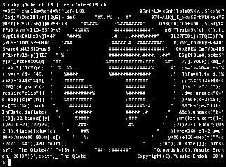
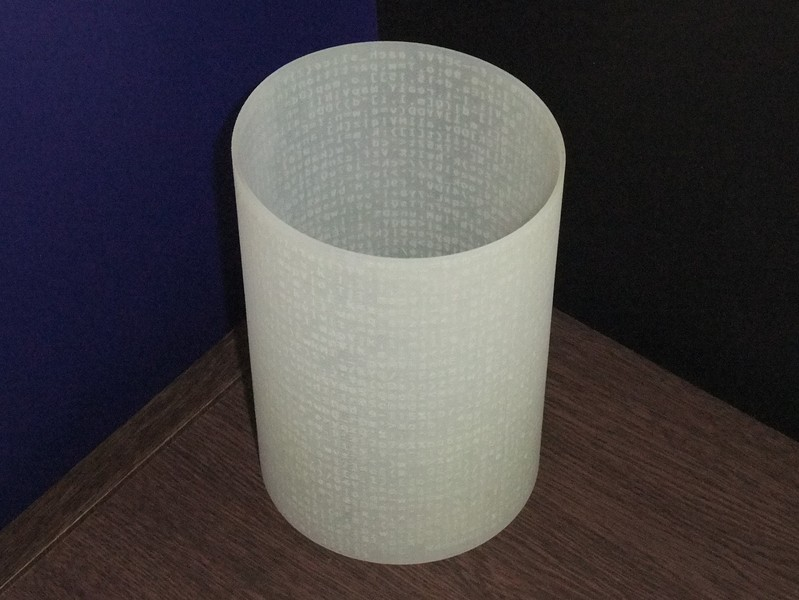
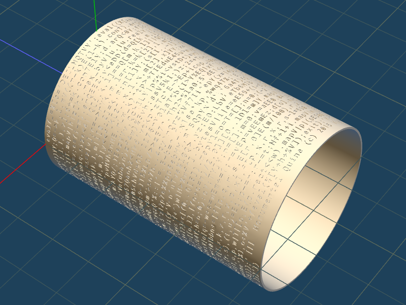
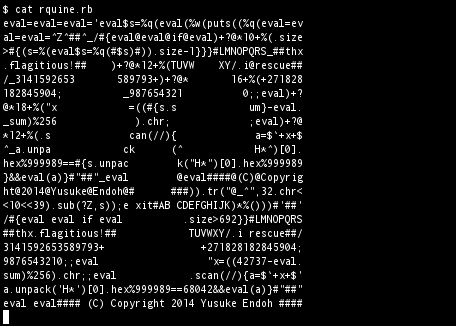
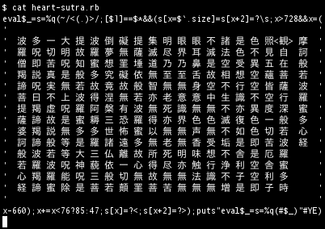
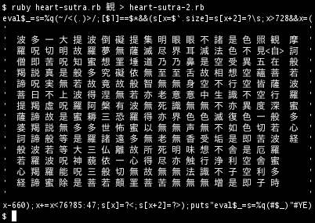

**「実用性とか気にせずにプログラミングで遊ぼう！」**という本です。

以下に示すようなプログラムが約 40 件掲載されています。
もちろん、作り方の解説も載ってます。
さらに、知る人ぞ知る、“[IOCCC](http://ioccc.org/)”（C 言語プログラムの難読化で競い合う国際プログラミングコンテスト）の紹介と、近年の傾向と対策、入賞へのヒントなども。

詳しくは[技術評論社サイトの目次](https://gihyo.jp/book/2015/978-4-7741-7643-7#toc)や、[著者による紹介記事](http://d.hatena.ne.jp/ku-ma-me/20150901/p1)をご覧ください。

## プログラム例

実行すると地球がまわるプログラム。

自己言及的な円柱。
Rubyプログラムが刻まれていて、実行するとこの円柱の3Dデータが出てくる。

端末で動くアスキーアート流体シミュレータ。［[動画](https://www.youtube.com/watch?v=QMYfkOtYYlg)］

実行可能なライフゲームGIFファイル。

1文字消しても元に戻るプログラム。

般若心経を写経しないと実行が進まないプログラム。

